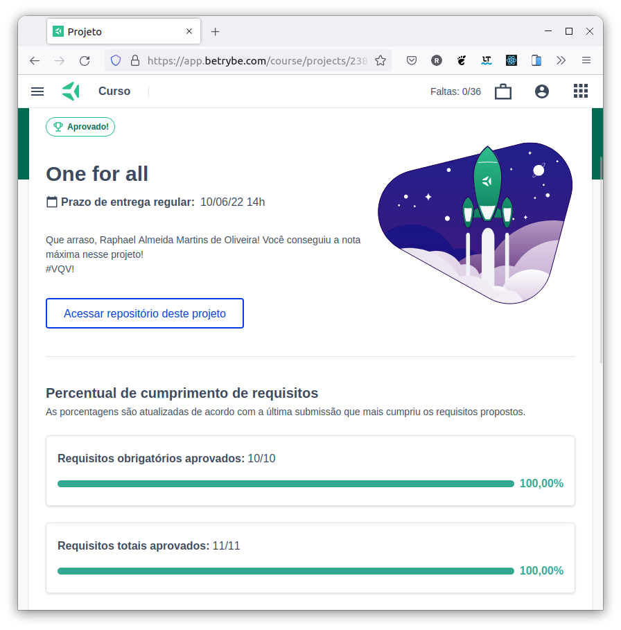

# :minidisc: MySQL One For All :floppy_disk:

## :page_with_curl: About/Sobre

  
<strong>:us: English</strong>
 

MySQL project developed by [Raphael Martins](https://www.linkedin.com/in/raphaelameidamartins/) at the end of Unit 21 ([Back-end Development Module](https://github.com/raphaelalmeidamartins/trybe_exercicios/tree/main/3_Desenvolvimento-Back-end)) of Trybe's Web Development course. I was approved with 100% of the mandatory and optional requirements met.

We had to use SQL to create a database and to manipulate and access its data.
 

  
<strong>:brazil: Português</strong>
 

Projeto MySQL desenvolvido por [Raphael Martins](https://www.linkedin.com/in/raphaelameidamartins/) ao final do Bloco 21 ([Módulo Desenvolvimento Back-end](https://github.com/raphaelalmeidamartins/trybe_exercicios/tree/main/3_Desenvolvimento-Back-end)) do curso de Desenvolvimento Web da Trybe. Fui aprovado com 100% dos requisitos obrigatórios e opcionais atingidos.

Tivemos que utilizar comandos SQL para criar um banco de dados e para manipular e acessar seus dados.
 

## :man_technologist: Developed Skills/Habilidades Desenvolvidas

  
<strong>:us: English</strong>
 

* Use SQL to create a database and to manipulate and access its datad
 

  
<strong>:brazil: Português</strong>
 

* Usar SQL parar criar um banco de dados e para manipular e acessar seus dados
 

## :hammer_and_wrench: Tools/Ferramentas

* SQL
* Docker CLI

## :trophy: Grade/Nota

