# Boas vindas ao repositório do projeto One For All!

Para desenvolver os projetos, você deverá seguir as instruções a seguir. Fique atento a cada passo e, se tiver qualquer dúvida, nos envie por Slack! #vqv 🚀

Aqui você vai encontrar os detalhes de como estruturar o desenvolvimento do seu projeto a partir desse repositório, utilizando uma branch específica e um Pull Request para colocar seus códigos.

# Termos e acordos

Ao iniciar este projeto, você concorda com as diretrizes do Código de Conduta e do Manual da Pessoa Estudante da Trybe.

# Entregáveis

<details>
  <summary><strong>🤷🏽‍♀️ Como entregar</strong></summary><br />

Para entregar o seu projeto você deverá criar um Pull Request neste repositório.

Lembre-se que você pode consultar nosso conteúdo sobre [Git & GitHub](https://app.betrybe.com/course/4d67f5b4-34a6-489f-a205-b6c7dc50fc16/) e nosso [Blog - Git & GitHub](https://blog.betrybe.com/tecnologia/git-e-github/) sempre que precisar!
</details>

<details>
  <summary><strong>👨‍💻 O que deverá ser desenvolvido</strong></summary><br />

Hoje, no projeto ***One For All***, você usará **uma** tabela para revisar e consolidar **todos** os principais conceitos vistos até o momento.

Você receberá uma tabela não normalizada que deverá ser normalizada e populada para que você possa executar queries com o intuito de encontrar as informações solicitadas.

## Desenvolvimento

Normalize uma tabela na terceira forma normal e acesse as informações desta tabela através de `queries` utilizando `SQL`.

</details>

<details>
  <summary><strong>🗓 Data de Entrega</strong></summary><br />

  - Serão `2` dias de projeto.
  - Data de entrega para avaliação final do projeto: `09/06/2022 14:00`.

</details>

## Orientações

<details>
  <summary><strong>:whale: Rodando no Docker vs Localmente</strong></summary><br />
  
  ## Com Docker
 
  > Rode os serviços `node` e `db` com o comando `docker-compose up -d`.
  - Lembre-se de parar o `mysql` se estiver usando localmente na porta padrão (`3306`), ou adapte, caso queria fazer uso da aplicação em containers
  - Esses serviços irão inicializar um container chamado `one_for_all` e outro chamado `one_for_all_db`.
  - A partir daqui você pode rodar o container `one_for_all` via CLI ou abri-lo no VS Code.

  > Use o comando `docker exec -it one_for_all bash`.
  - Ele te dará acesso ao terminal interativo do container criado pelo compose, que está rodando em segundo plano;
  - As credencias de acesso ao banco de dados estão definidas no arquivo `docker-compose.yml`, e são acessíveis no container através das variáveis de ambiente `MYSQL_USER` e `MYSQL_PASSWORD`. 💡

  > Instale as dependências [**Caso existam**] com `npm install`
  
  ⚠ Atenção ⚠ Caso opte por utilizar o Docker, **TODOS** os comandos disponíveis no `package.json` (npm start, npm test, npm run dev, ...) devem ser executados **DENTRO** do container, ou seja, no terminal que aparece após a execução do comando `docker exec` citado acima. 

  ⚠ Atenção ⚠ O **git** dentro do container não vem configurado com suas credenciais. Ou faça os commits fora do container, ou configure as suas credenciais do git dentro do container.

  ⚠ Atenção ⚠ Não rode o comando npm audit fix! Ele atualiza várias dependências do projeto, e essa atualização gera conflitos com o avaliador.


✨ **Dica:** A extensão `Remote - Containers` (que estará na seção de extensões recomendadas do VS Code) é indicada para que você possa desenvolver sua aplicação no container Docker direto no VS Code, como você faz com seus arquivos locais.


 :warning: Atenção :warning: Para que você consiga rodar o seu projeto com docker e o avaliador funcione é fundamental que o seu docker compose esteja na **versão 1.29** 
 primeiro verifique sua versão 
 > docker-compose --version

 Se não for a versão 1.29, faça os seguintes comandos para atualizar a versão:
 
 >sudo rm /usr/local/bin/docker-compose

 >sudo curl -L "https://github.com/docker/compose/releases/download/1.29.0/docker-compose-$(uname -s)-$(uname -m)" -o /usr/local/bin/docker-compose

 >sudo chmod +x /usr/local/bin/docker-compose


---
  
  ## Sem Docker
  
  
  > Instale as dependências [**Caso existam**] com `npm install`
  
  ⚠ Atenção ⚠ Não rode o comando npm audit fix! Ele atualiza várias dependências do projeto, e essa atualização gera conflitos com o avaliador.

  ✨ **Dica:** Para rodar o projeto desta forma, obrigatoriamente você deve ter o `node` instalado em seu computador.
  ✨ **Dica:** O avaliador espera que a versão do `node` utilizada seja a 16.

  <br/>
</details>


<details>
  <summary id="antes-comecar-desenvolver"><strong>‼️ Antes de começar a desenvolver</strong></summary><br />

1. Clone o repositório
  * `git clone https://github.com/tryber/sd-019-a-mysql-one-for-all.git`.
  * Entre na pasta do repositório que você acabou de clonar:
    * `cd sd-019-a-mysql-one-for-all`

2. Instale as dependências
  * `npm install`

3. Crie uma branch a partir da branch `master`
  * Verifique que você está na branch `master`
    * Exemplo: `git branch`
  * Se não estiver, mude para a branch `master`
    * Exemplo: `git checkout master`
  * Agora, crie uma branch onde você vai guardar os `commits` do seu projeto
    * Você deve criar uma branch no seguinte formato: `nome-de-usuario-nome-do-projeto`
    * Exemplo: `git checkout -b seunome-mysql-one-for-all`

4. Para cada exercício você deve criar um novo arquivo sql seguindo a seguinte estrutura:
  * desafio1.sql, desafio2.sql, desafio3.sql, desafio4.sql, ..., desafioN.sql
  * 💡 Use o seguinte comando para gerar os arquivos: `touch desafio{1..11}.sql`

5. Adicione as mudanças ao _stage_ do Git e faça um `commit`
  * Verifique que as mudanças ainda não estão no _stage_
    * Exemplo: `git status` (deve aparecer o arquivo que você alterou como desafio1.sql)
  * Adicione o novo arquivo ao _stage_ do Git
      * Exemplo:
        * `git add .` (adicionando solução para desafio 1)
        * `git status` (deve aparecer listado o arquivo _desafio1.sql_ em verde)
  * Faça o `commit` inicial
      * Exemplo:
        * `git commit -m 'iniciando o projeto MySQL One For All'` (fazendo o primeiro commit)
        * `git status` (deve aparecer uma mensagem tipo _nothing to commit_ )

</details>

<details>
  <summary><strong>⌨️ Durante o desenvolvimento</strong></summary><br />

* Faça `commits` das alterações que você fizer no código regularmente

* Lembre-se de sempre após um (ou alguns) `commits` atualizar o repositório remoto

* Os comandos que você utilizará com mais frequência são:
  1. `git status` _(para verificar o que está em vermelho - fora do stage - e o que está em verde - no stage)_
  2. `git add` _(para adicionar arquivos ao stage do Git)_
  3. `git commit` _(para criar um commit com os arquivos que estão no stage do Git)_
  4. `git push -u origin nome-da-branch` _(para enviar o commit para o repositório remoto na primeira vez que fizer o `push` de uma nova branch)_
  5. `git push` _(para enviar o commit para o repositório remoto após o passo anterior)_

</details>

<details>
  <summary><strong>🤝 Depois de terminar o desenvolvimento (opcional)</strong></summary><br />

  Para **"entregar"** seu projeto, siga os passos a seguir:

* Vá até a página **DO SEU** _Pull Request_, adicione a label de _"code-review"_ e marque seus colegas
  * No menu à direita, clique no _link_ **"Labels"** e escolha a _label_ **code-review**
  * No menu à direita, clique no _link_ **"Assignees"** e escolha **o seu usuário**
  * No menu à direita, clique no _link_ **"Reviewers"** e digite `students`, selecione o time `tryber/students-sd-00`

Se ainda houver alguma dúvida sobre como entregar seu projeto [aqui tem um video explicativo](https://vimeo.com/362189205).

</details>

<details>
  <summary><strong>🕵🏿 Revisando um pull request</strong></summary><br />

  Use o conteúdo sobre [Code Review](https://app.betrybe.com/course/real-life-engineer/code-review) para te ajudar a revisar os _Pull Requests_.

</details>

<details>
  <summary><strong>📌 Como desenvolver</strong></summary><br />

Para cada desafio, crie um arquivo SQL e inclua sua solução nele.

1. Leia a pergunta e crie um arquivo **na pasta raiz do projeto** chamado `desafioN.sql`, em que N é o número do desafio (exemplo: desafio3.sql). Para o [primeiro desafio](#desafio-1), é preciso criar também o arquivo de configurações `desafio1.json` *também na pasta raiz do projeto*.

2. O arquivo deve conter apenas o código SQL do desafio resolvido. **Não se esqueça de incluir o ponto e vírgula (";")** no final de suas queries e também de **colocar o nome do banco_de_dados.tabela por completo**, como no exemplo a seguir:
```sql
SELECT * FROM SpotifyClone.artista;
```


⚠️ **AVISO IMPORTANTE:** sempre seguir esse padrão e não utilizar a linha abaixo nos arquivos `desafionN.sql`,

```sql
USE SpotifyClone;
```

3. Atente-se a detalhes de digitação em seu código. Qualquer diferença em nomes, apelidos, ou CAIXA ALTA e caixa baixa podem invalidar suas respostas.

4. Faça isso até finalizar todos os desafios e depois siga as instruções de como entregar o projeto em [**Instruções para entregar seu projeto**](#antes-comecar-desenvolver)

5. Para entregar o seu projeto você deverá criar um _Pull Request_ neste repositório. Este _Pull Request_ deverá conter tanto o arquivo de configurações `desafio1.json` do [primeiro desafio](#desafio-1) quanto os arquivos `desafio1.sql`, `desafio2.sql` e assim por diante até o `desafio11.sql`, que conterão seu código `SQL` de cada desafio, respectivamente.

## ⚠️ É importante que seus arquivos tenham exatamente estes nomes! ⚠️

Qualquer dúvida, procure a monitoria. Lembre-se que você pode consultar nosso conteúdo sobre [Git & GitHub](https://app.betrybe.com/course/fundamentals/git-github-e-internet/git-github-o-que-e-e-para-que-serve/82dcab41-249a-4738-8920-f0eb2cb91d1c/conteudos/9d578f82-1f07-46c9-9240-102619a8c583/mas-o-que-e-mesmo-esse-controle-de-versao/5095c56b-9d5c-428b-875e-8a3d857f4b37?use_case=side_bar) sempre que precisar!

</details>

<details>
  <summary><strong>🎯 Problema a ser resolvido</strong></summary><br />


Você receberá uma tabela não normalizada semelhante ao que poderia ser uma versão simplificada do banco de dados do Spotify. O trabalho consistirá de duas partes:

1. Normalizar essa tabela, criar o schema no seu banco de dados local e populá-lo;

2. Realizar os desafios no seu banco normalizado e populado.

**Aviso:** Todos os dados da tabela abaixo são fictícios e foram gerados aleatoriamente através de ferramentas com o intuito de deixar o projeto mais real para vocês 😉. Quaisquer similaridades com informações reais são meras coincidências.

**Observação:** O banco de dados real do Spotify é muito mais completo e complexo que o mostrado abaixo. No entanto, use APENAS as informações passadas e solicitadas aqui. Não crie dados que não foram solicitados.

## Normalize as tabelas para a 3ª Forma Normal

Abaixo você pode visualizar e baixar uma planilha com as tabelas que deverão ser normalizadas:

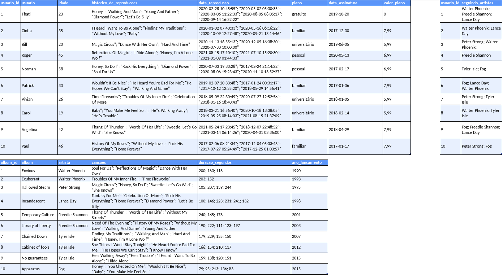
[Faça o download dela aqui](./SpotifyClone-Non-NormalizedTable.xlsx)
Como o VS Code não oferece suporte para abrir planilhas, você precisa ter alguma software de especifico para isso, aqui deixamos algumas sugestões:
- [LibreOffice Calc](https://www.libreoffice.org/download/download/) para distros Linux;
- [Numbers](https://www.apple.com/br/numbers/) Mac OS;
- Google planilhas para utilizar no browser;
-  Extensão para o VS Code como a Excel Viewer;

> Obs. Em alguns SOs já costuma vir instalado algum programa para manipular planilhas.

Antes de tudo, você deverá modelar e normalizar essas tabelas para a 3° Forma Normal. Monte quantas planilhas e tabelas forem necessárias para criar essa versão normalizada desde que você siga as regras de negócio. Não é necessário criar o código SQL neste momento.

**Embora não seja necessário, é recomendado que você crie suas planilhas na sequência 1ª -> 2ª -> 3ª Forma Normal**.

Caso haja dúvidas, consulte o material já passado até hoje para te auxiliar.

Seu banco de dados deve seguir as regras de negócio e ser capaz de recuperar:

* Informações sobre quais planos estão disponíveis e seus detalhes;
  * Cada pessoa usuária pode possuir apenas um plano.

* Informações sobre todas as pessoas artistas;
  * Uma pessoa artista pode ter vários álbuns;
  * Uma pessoa artista pode ser seguida por várias pessoas usuárias.

* Informações sobre todos os álbuns de cada artista;
  * Para fins deste projeto, considere que cada álbum possui apenas uma pessoa artista como principal;
  * Cada álbum possui várias canções.

* Informações sobre todas as canções de cada álbum;
  * Para fins deste projeto, considere que cada canção está contida em apenas um álbum.

* Informações sobre todas as pessoas usuárias, seus planos, seu histórico de reprodução e pessoas artistas seguidas.
  * Uma pessoa usuária pode possuir apenas um plano;
  * Cada música do histórico de reprodução pode aparecer uma única vez por pessoa (para simplificar, considere que o objetivo do histórico é saber **quais** canções já foram reproduzidas e **não quantas vezes** foram reproduzidas);
  * Uma pessoa usuária pode seguir várias pessoas artistas, mas cada pessoa artista pode ser seguida apenas uma vez por pessoa usuária.

</details>

<details>
  <summary><strong>🧑‍💻 Implementações técnicas</strong></summary><br />

Algumas coisas devem seguir um padrão pré-estabelecido para que os testes de correção funcionem adequadamente:

1. Ao modelar o banco de dados no [desafio 1](#desafio-1):

  * Quando for preciso que uma `coluna_a` referencie uma coluna `coluna_b` em outra tabela, é **necessário** que na `coluna_a` haja restrição de foreign key e que `coluna_b` seja uma primary key;

2. **Todos** os desafios que pedirem para criar uma query **devem** possuir no seu arquivo `.sql` correspondente **somente** a query solicitada.

3. Para executar localmente os testes é preciso escrever o seguinte no seu terminal:
    ```sh
    MYSQL_USER=<SEU_NOME_DE_PESSOA_USUARIA> MYSQL_PASSWORD=<SUA SENHA> HOSTNAME=<NOME_DO_HOST> PORT=<PORTA> npm test
    ```

  * Ou seja, suponha que para poder acessar a base de dados feita neste projeto você tenha `root` como seu nome de pessoa usuária, `password` como senha, `localhost` como host e `1337` como porta. Logo, você executaria:
    ```sh
    MYSQL_USER=root MYSQL_PASSWORD=password HOSTNAME=localhost PORT=1337 npm test
    ```

  * Usando o exemplo anterior de base, suponha que você não tenha setado uma senha para `root` e esteja usando a porta padrão (3306). Neste caso, você executaria:
    ```sh
    MYSQL_USER=root MYSQL_PASSWORD= HOSTNAME=localhost PORT= npm test
    ```

**Dica**: variáveis de ambiente definidas na mesma linha do comando valem apenas para aquele comando. Se preferir, você pode exportar as variáveis de ambiente para toda a _sessão_ (todos os comandos até você fechar aquele terminal). Por exemplo:

```sh
export MYSQL_USER=root MYSQL_PASSWORD=password HOSTNAME=localhost PORT=3306
```

E depois disso você só precisa rodar `npm test` quando for testar os projetos.

⚠️ **Dica**: O avaliador espera que a versão do  MySQL seja a 5.7. Em caso de erro nos testes, verifique se essa é a versão que está sendo usada por você.⚠️

⚠️ **Dica**: Caso queira utilizar _Docker_ para rodar os testes localmente, basta executar o comando: ⚠️

```sh
docker run -p 3306:3306 --name mysql_57 -e MYSQL_ROOT_PASSWORD=1234 -d mysql:5.7 mysqld --default-authentication-plugin=mysql_native_password
```

<details close>
  <summary>O que está sendo feito</summary>
  <br>
   > :point_right: ideia geral:
  - Baixa e executa uma imagem _docker_ do MySQL na versão 5.7.

  > :point_right: flag --name:
  - Define um nome para o nosso _container_: "meu-mysql-5_7".

  > :point_right: flag -e:
  - Define a variável de ambiente "MYSQL_ROOT_PASSWORD" com o valor "1234".

  > :point_right: flag -d:
  - Define que o container rode em segundo plano.

  > :point_right: flag -p:
  - Mapeia uma porta local a uma porta do _container_.

  > :point_right: mysql:5.7:
  - Define qual versão da imagem  mySQL queremos, no caso, a 5.7, que é a esperada pelo avaliador.
</details>

Utilizando o comando acima, para executar os testes localmente basta digitar no terminal:

```sh
MYSQL_USER=root MYSQL_PASSWORD=1234 HOSTNAME=localhost npm test
```

  </details>

  <details>
  <summary><strong>🗣 Nos dê feedbacks sobre o projeto!</strong></summary><br />

Ao finalizar e submeter o projeto, não se esqueça de avaliar sua experiência preenchendo o formulário.
**Leva menos de 3 minutos!**

[FORMULÁRIO DE AVALIAÇÃO DE PROJETO](https://be-trybe.typeform.com/to/ZTeR4IbH)

:warning: **O avaliador automático não necessariamente avalia seu projeto na ordem em que os requisitos aparecem no readme. Isso acontece para deixar o processo de avaliação mais rápido. Então, não se assuste se isso acontecer, ok?**

</details>

<details>
  <summary><strong>🗂 Compartilhe seu portfólio!</strong></summary><br />

  Você sabia que o LinkedIn é a principal rede social profissional e compartilhar o seu aprendizado lá é muito importante para quem deseja construir uma carreira de sucesso? Compartilhe esse projeto no seu LinkedIn, marque o perfil da Trybe (@trybe) e mostre para a sua rede toda a sua evolução.

</details>

# Requisitos do projeto

⚠️ **AVISO IMPORTANTE:** Você deve escrever sua query manualmente, com o gerador automático de queries do Workbench o avaliador não funcionará corretamente!

## Desafio 1

* Crie um banco com o nome de **`SpotifyClone`**.

* Providencie as queries necessárias para criar tabelas normalizadas que atendam aos requisitos descritos na seção anterior;

* Providencie as queries necessárias para popular as tabelas de acordo com os dados listados na seção anterior;

* Crie um arquivo de configurações `desafio1.json`, que mapeará em qual tabela e coluna se encontram as informações necessárias para a avaliação automatizada deste desafio. 

<details>
  <summary><strong>👇 As configurações devem possuir o seguinte formato</strong></summary><br />

  ```json
  {
    "coluna_usuario": "nome-da-coluna",
    "tabela_que_contem_usuario": "nome-da-tabela-que-armazena-a-coluna",
    "coluna_plano": "nome-da-coluna",
    "tabela_que_contem_plano": "nome-da-tabela-que-armazena-a-coluna",
    "coluna_historico_de_reproducoes": "nome-da-coluna",
    "tabela_que_contem_historico_de_reproducoes": "nome-da-tabela-que-armazena-a-coluna",
    "coluna_seguindo_artistas": "nome-da-coluna",
    "tabela_que_contem_seguindo_artistas": "nome-da-tabela-que-armazena-a-coluna",
    "coluna_artista": "nome-da-coluna",
    "tabela_que_contem_artista": "nome-da-tabela-que-armazena-a-coluna",
    "coluna_album": "nome-da-coluna",
    "tabela_que_contem_album": "nome-da-tabela-que-armazena-a-coluna",
    "coluna_cancoes": "nome-da-coluna",
    "tabela_que_contem_cancoes": "nome-da-tabela-que-armazena-a-coluna"
  }
  ```

  Essa configuração deve ser feita baseada no seu banco de dados **após a normalização**. Ou seja, se você criou uma tabela chamada `users` que possui a coluna `name`, você substituiria `"coluna_usuario"` e `"tabela_que_contem_usuario"` da seguinte forma:

  ```json
  {
    "coluna_usuario": "name",
    "tabela_que_contem_usuario": "users",
    ...
  }
  ```

</details>

* Salve as queries criadas no arquivo `desafio1.sql`.

<details>
<summary><strong>👇 Seu código deverá ser similar ao seguinte</strong></summary><br />

  ```sql
  DROP DATABASE IF EXISTS SpotifyClone;

  CREATE DATABASE SpotifyClone;

  CREATE TABLE SpotifyClone.tabela1(
      coluna1 tipo restricoes,
      coluna2 tipo restricoes,
      colunaN tipo restricoes,
  ) engine = InnoDB;

  CREATE TABLE SpotifyClone.tabela2(
      coluna1 tipo restricoes,
      coluna2 tipo restricoes,
      colunaN tipo restricoes,
  ) engine = InnoDB;

  INSERT INTO SpotifyClone.tabela1 (coluna1, coluna2)
  VALUES
    ('exemplo de dados 1', 'exemplo de dados A'),
    ('exemplo de dados 2', 'exemplo de dados B'),
    ('exemplo de dados 3', 'exemplo de dados C');

  INSERT INTO SpotifyClone.tabela2 (coluna1, coluna2)
  VALUES
    ('exemplo de dados 1', 'exemplo de dados X'),
    ('exemplo de dados 2', 'exemplo de dados Y');
  ```

</details>

<details>
<summary><strong>☑️ O que será verificado</strong></summary><br />

  - Será validado se os planos estão na tabela normalizada.

  - Será validado se o histórico de reprodução está na tabela normalizada.

  - Será validado se as informações sobre pessoas seguindo artistas estão na tabela normalizada.

  - Será validado se os álbuns estão na tabela normalizada.

  - Será validado se as canções estão na tabela normalizada.

  - Será validado se as informações sobre pessoas usuárias estão na tabela normalizada.

  - Será validado se as informações sobre artistas estão na tabela normalizada.

  ⚠️ Note que uma vez executado um teste, a sua base de dados `SpotifyClone` **será dropada**. Logo, **se atente** a salvar seu progresso nos arquivos de desafio! ⚠️
 
</details>

## Desafio 2

Crie uma `QUERY` que exiba três colunas:

1. A primeira coluna deve exibir a quantidade total de canções. Dê a essa coluna o alias "**cancoes**".

2. A segunda coluna deve exibir a quantidade total de artistas e deverá ter o alias "**artistas**".

3. A terceira coluna deve exibir a quantidade de álbuns e deverá ter o alias "**albuns**".

<details>
  <summary><strong>➕ Informações complementares</strong></summary><br />

Sua `QUERY` deve retornar a seguinte informação:

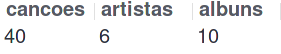

O que será verificado:

- Será validado se existe uma `QUERY` que exibe os dados corretos nas colunas `cancoes`, `artistas` e `albuns`.

</details>

## Desafio 3

Crie uma `QUERY` que deverá ter apenas três colunas:

1. A primeira coluna deve possuir o alias "**usuario**" e exibir o nome da pessoa usuária.

2. A segunda coluna deve possuir o alias "**qtde_musicas_ouvidas**" e exibir a quantidade de músicas ouvida pela pessoa com base no seu histórico de reprodução.

3. A terceira coluna deve possuir o alias "**total_minutos**" e exibir a soma dos minutos ouvidos pela pessoa usuária com base no seu histórico de reprodução.

Os resultados devem estar agrupados pelo nome da pessoa usuária e ordenados em ordem alfabética.

<details>
  <summary><strong>➕ Informações complementares</strong></summary><br />

Sua `QUERY` deve retornar a seguinte informação:

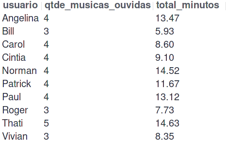

O que será verificado:

- Será validado se existe uma `QUERY` que exibe os dados corretos nas colunas `usuario`, `qtde_musicas_ouvidas` e `total_minutos`.

- Será validado se as colunas estão ordenadas de forma correta.

</details>

## Desafio 4

Crie uma `QUERY` que deve mostrar as pessoas usuárias que estavam ativas no ano de **2021** se baseando na data mais recente no histórico de reprodução.

1. A primeira coluna deve possuir o alias "**usuario**" e exibir o nome da pessoa usuária.

2. A segunda coluna deve ter o alias "**condicao_usuario**" e exibir se a pessoa usuária está ativa ou inativa.

O resultado deve estar ordenado em ordem alfabética.

<details>
  <summary><strong>➕ Informações complementares</strong></summary><br />

Sua `QUERY` deve retornar a seguinte informação:

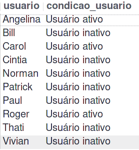

O que será verificado:

- Será validado se existe uma `QUERY` que exibe os dados corretos nas colunas `usuario` e `condicao_usuario`.

- Será validado se as colunas estão ordenadas de forma correta.

</details>

## Desafio 5

Estamos fazendo um estudo das músicas mais tocadas e precisamos saber quais são as duas músicas mais tocadas no momento. Crie uma `QUERY` que possua duas colunas:

1. A primeira coluna deve possuir o alias "**cancao**" e exibir o nome da canção.

2. A segunda coluna deve possuir o alias "**reproducoes**" e exibir a quantidade de pessoas que já escutaram a canção em questão.

Seu resultado deve estar ordenado em ordem decrescente, baseando-se no número de reproduções. Em caso de empate, ordene os resultados pelo nome da canção em ordem alfabética. Queremos apenas o top 2 de músicas mais tocadas.

<details>
  <summary><strong>➕ Informações complementares</strong></summary><br />

Sua `QUERY` deve retornar a seguinte informação:

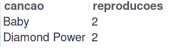


O que será verificado:

- Será validado se existe uma `QUERY` que exibe os dados corretos nas colunas `cancao` e `reproducoes`.

- Será validado se as colunas estão ordenadas de forma correta.

</details>

## Desafio 6

Tendo como base o valor dos planos e o plano que cada pessoa usuária cadastrada possui no banco, queremos algumas informações sobre o faturamento da empresa. Crie uma `QUERY` que deve exibir quatro dados:

1. A primeira coluna deve ter o alias "**faturamento_minimo**" e exibir o menor valor de plano existente para uma pessoa usuária.

2. A segunda coluna deve ter o alias "**faturamento_maximo**" e exibir o maior valor de plano existente para uma pessoa usuária.

3. A terceira coluna deve ter o alias "**faturamento_medio**" e exibir o valor médio dos planos possuídos por pessoas usuárias até o momento.

4. Por fim, a quarta coluna deve ter o alias "**faturamento_total**" e exibir o valor total obtido com os planos possuídos por pessoas usuárias.

Para cada um desses dados, por se tratarem de valores monetários, deve-se arredondar o faturamento usando apenas duas casas decimais.

<details>
  <summary><strong>➕ Informações complementares</strong></summary><br />

Sua `QUERY` deve retornar a seguinte informação:

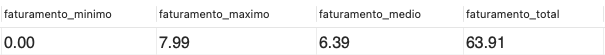

O que será verificado:

- Será validado se existe uma `QUERY` que exibe os dados corretos nas colunas `faturamento_minimo`, `faturamento_maximo`, `faturamento_medio` e `faturamento_total`.

</details>

## Desafio 7

Mostre uma relação de todos os álbuns produzidos por cada pessoa artista, com a quantidade de seguidores que ela possui, de acordo com os detalhes a seguir. Para tal, crie uma `QUERY` com as seguintes colunas:

1. A primeira coluna deve exibir o nome da pessoa artista, com o alias "**artista**".

2. A segunda coluna deve exibir o nome do álbum, com o alias "**album**".

3. A terceira coluna deve exibir a quantidade de pessoas seguidoras que aquela pessoa artista possui e deve possuir o alias "**seguidores**".

Seus resultados devem estar ordenados de forma decrescente, baseando-se no número de pessoas seguidoras. Em caso de empate no número de pessoas, ordene os resultados pelo nome da pessoa artista em ordem alfabética e caso há artistas com o mesmo nome, ordene os resultados pelo nome do álbum alfabeticamente.

<details>
  <summary><strong>➕ Informações complementares</strong></summary><br />

Sua `QUERY` deve retornar a seguinte informação:

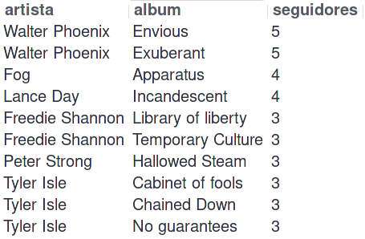

O que será verificado:

- Será validado se existe uma `QUERY` que exibe os dados corretos nas colunas `artista`, `album` e `seguidores`.

- Será validado se as colunas estão ordenadas de forma correta.

</details>

## Desafio 8

Mostre uma relação dos álbuns produzidos por um artista específico, neste caso `"Walter Phoenix"`.
Para isto crie uma `QUERY` que o retorno deve exibir as seguintes colunas:

1. O nome da pessoa artista, com o alias "**artista**".

2. O nome do álbum, com o alias "**album**".

Os resultados devem ser ordenados pelo nome do álbum em ordem alfabética.

<details>
  <summary><strong>➕ Informações complementares</strong></summary><br />

Sua `QUERY` deve retornar a seguinte informação:

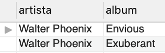

O que será verificado:

- Será validado se a `QUERY` retorna a coluna `artista` contendo o nome da pessoa artista e a coluna `album` contendo o nome do álbum.

- Será validado se as colunas estão ordenadas de forma correta.

</details>

## Desafio 9

Crie uma `QUERY` que exibe a quantidade de músicas que estão presentes atualmente no histórico de reprodução de uma pessoa usuária específica. Para este caso queremos saber quantas músicas estão no histórico do usuário `"Bill"` e a consulta deve retornar a seguinte coluna:

1. O valor da quantidade, com o alias "**quantidade_musicas_no_historico**".

<details>
  <summary><strong>➕ Informações complementares</strong></summary><br />

Sua `QUERY` deve retornar a seguinte informação:

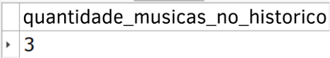


O que será verificado:

- Será validado se a `QUERY` retorna a quantidade correta de canções presentes no histórico de reprodução da pessoa especificada.

</details>

## Desafio 10

Crie uma `QUERY` que exiba o nome e a quantidade de vezes que cada canção foi tocada por pessoas usuárias do plano gratuito ou pessoal de acordo com os detalhes a seguir:

* A primeira coluna deve exibir o nome da canção, com o alias "**nome**";

* A segunda coluna deve exibir a quantidade de pessoas que já escutaram aquela canção, com o alias "**reproducoes**";

* Seus resultados devem estar agrupados pelo nome da canção e ordenados em ordem alfabética.

<details>
  <summary><strong>➕ Informações complementares</strong></summary><br />

Sua `QUERY` deve retornar a seguinte informação:

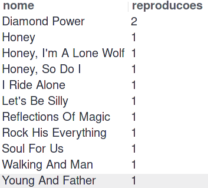

O que será verificado:

- Será validado se existe uma `QUERY` que exibe os dados corretos nas colunas `nome` e `reproducoes`.

- Será validado se as colunas estão ordenadas de forma correta.

</details>

## BÔNUS

### Desafio 11

Crie uma `QUERY` que altere o nome de algumas músicas e as ordene em ordem alfabética com as colunas abaixo se baseando nos seguintes critérios:

1. O nome da música em seu estado normal com o alias **nome_musica**

2. O nome da música atualizado com o alias **novo_nome**

**Critérios**

- Trocar a palavra **"Streets"** no final do nome de uma música por **"Code Review"**

- Trocar a palavra **"Her Own"** no final do nome de uma música por **"Trybe"**

- Trocar a palavra **"Inner Fire"** no final do nome de uma música por **"Project"**

- Trocar a palavra **"Silly"** no final do nome de uma música por **"Nice"**

- Trocar a palavra **"Circus"** no final do nome de uma música por **"Pull Request"**

<details>
  <summary><strong>➕ Informações complementares</strong></summary><br />

Sua `QUERY` retornar a seguinte informação:

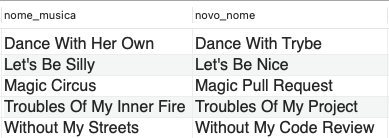

O que será verificado:

- Será validado se existe uma `QUERY` que exibe os dados corretos nas colunas `nome_musica` e `novo_nome`.

- Será validado se as colunas estão ordenadas de forma correta.

</details>
